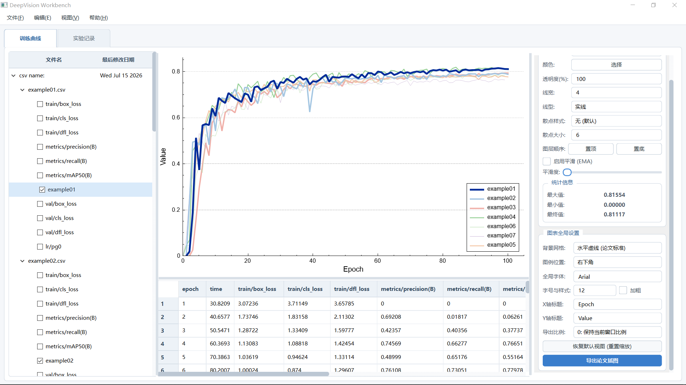
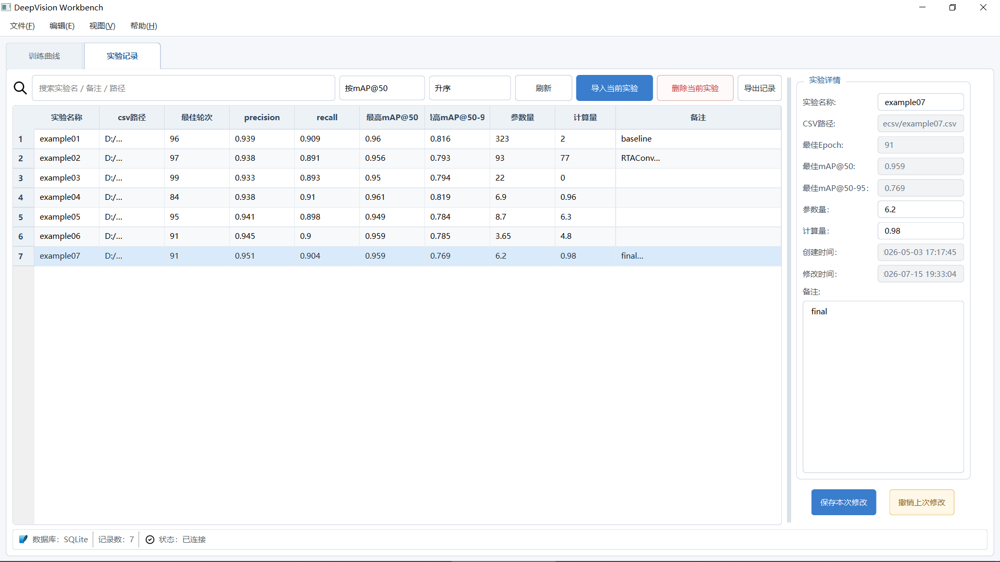

# DeepVision Workbench

<p align="center">
  <strong>面向深度学习实验管理与结果分析的 Qt/C++ 桌面工具</strong>
</p>

<p align="center">
  
  
  
  
  <a href="./LICENSE"></a>
</p>

## 项目简介

**DeepVision Workbench** 是一款使用 **Qt 6、C++17 和 CMake** 开发的桌面应用，主要用于整理、查看和分析深度学习模型的训练结果。

项目最初是一个 CSV 训练日志可视化工具，现已逐步扩展为实验结果工作台。目前包含 CSV 指标分析、训练曲线绘制、实验记录管理、SQLite 数据持久化以及表格导出等功能。

本项目目前仍处于开发阶段，功能和界面可能继续调整。

## 界面预览

<p align="center">
  
</p>

<p align="center">
  
</p>


## 主要功能

### CSV 结果分析

- 导入单个或多个 CSV 训练日志
- 以树形结构管理实验文件及指标
- 显示完整训练数据表格
- 绘制 Loss、Precision、Recall、mAP 等训练曲线
- 支持曲线显示、隐藏、重命名及样式调整
- 支持鼠标缩放、拖动和图例交互
- 根据指标自动定位最佳训练轮次
- 显示最大值、最小值、最终值等统计信息
- 导出训练曲线和实验数据

### 实验记录管理

- 将当前 CSV 实验导入实验库
- 自动保存实验名称、文件路径和最佳 Epoch
- 记录 Precision、Recall、mAP50、mAP50-95 等核心指标
- 保存模型参数量、GFLOPs、训练参数及备注
- 使用 SQLite 持久化实验数据
- 支持查看、编辑和管理历史实验记录
- 支持导出实验记录表格

### 桌面端交互

- 多页面工作区
- 可调整的分栏布局
- 面板显示与隐藏
- 全屏模式
- 默认布局恢复
- Qt 资源系统管理图标与界面样式

## 适用场景

DeepVision Workbench 适合以下工作：

- YOLO 系列模型训练结果分析
- 多组消融实验对比
- 模型精度与复杂度记录
- 论文图表整理
- 深度学习实验归档
- CSV 指标数据快速查看

程序主要面向 Ultralytics YOLO 训练产生的 `results.csv`，其他结构相近的 CSV 文件也可以根据表头进行读取。

## 技术栈

| 模块 | 技术 |
|---|---|
| 编程语言 | C++17 |
| GUI 框架 | Qt 6 Widgets |
| 图表绘制 | QCustomPlot |
| 数据库 | SQLite / Qt SQL |
| Excel 支持 | QXlsx |
| 构建系统 | CMake 3.16+ |
| 主要开发平台 | Windows |

## 项目结构

```text
DeepVisionWorkbench
├── src
│   ├── database          # SQLite 数据访问
│   ├── include           # 第三方库
│   ├── resource          # 图标、QSS 和 Qt 资源
│   ├── utils             # 工具类及 QCustomPlot
│   └── widget            # 主窗口及各功能页面
├── CMakeLists.txt
├── main.cpp
├── runtime.png
├── LICENSE
└── README.md
```

## 编译环境

建议使用以下环境：

- Windows 10 / Windows 11
- Qt 6.x
- CMake 3.16 或更高版本
- 支持 C++17 的编译器
  - MinGW 64-bit
  - MSVC 2022
- CLion 或 Qt Creator

## 从源码构建

### 1. 克隆仓库

```bash
git clone https://github.com/GRZ21/DeepVisionWorkbench.git
cd DeepVisionWorkbench
```

### 2. 使用 IDE 构建

使用 CLion 或 Qt Creator 打开根目录下的：

```text
CMakeLists.txt
```

配置与 Qt 安装相匹配的工具链，然后选择 `Release` 构建并运行。

### 3. 使用命令行构建

以下命令中的 `CMAKE_PREFIX_PATH` 需要替换为本机 Qt 路径：

```bash
cmake -S . -B build ^
  -DCMAKE_BUILD_TYPE=Release ^
  -DCMAKE_PREFIX_PATH="C:/Qt/6.x.x/mingw_64"

cmake --build build --config Release
```

PowerShell 也可以写成单行：

```powershell
cmake -S . -B build -DCMAKE_BUILD_TYPE=Release -DCMAKE_PREFIX_PATH="C:/Qt/6.x.x/mingw_64"
cmake --build build --config Release
```

使用 MSVC 时，将 Qt 路径替换为对应的 `msvc2022_64` 目录。

## Windows 部署

编译 Release 版本后，可以使用 Qt 自带的 `windeployqt` 收集依赖：

```powershell
windeployqt --release --compiler-runtime DeepVisionWorkbench.exe
```

部署目录中应包含 Qt DLL 及必要插件，例如：

```text
platforms/qwindows.dll
sqldrivers/qsqlite.dll
```

仓库的 Releases 页面可用于发布已打包的 Windows 版本。

## 开发计划

后续计划逐步加入：

- 多实验指标汇总与对比
- 更完善的图表平滑与统计功能
- 实验筛选、排序和标签管理
- ONNX 模型加载
- 图像与文件夹推理
- 检测结果可视化
- 推理结果及性能数据导出

上述内容属于开发计划，不代表当前版本已全部实现。

## 已知说明

- 当前版本主要针对 Windows 和 Qt 6 开发。
- 不同训练框架生成的 CSV 表头可能不同，部分文件可能需要适配。
- 数据库、日志和用户配置应保存在可写目录中，不建议直接写入程序安装目录。
- Beta 版本可能存在尚未发现的问题，重要实验数据请自行备份。

## 参与开发

欢迎通过 Issue 提交：

- Bug 反馈
- 功能建议
- CSV 兼容性问题
- 界面与交互改进建议

提交代码前，建议从 `master` 创建独立功能分支：

```bash
git switch -c feature/your-feature
```

完成后提交 Pull Request。

## License

本项目采用 [MIT License](./LICENSE) 开源协议。
